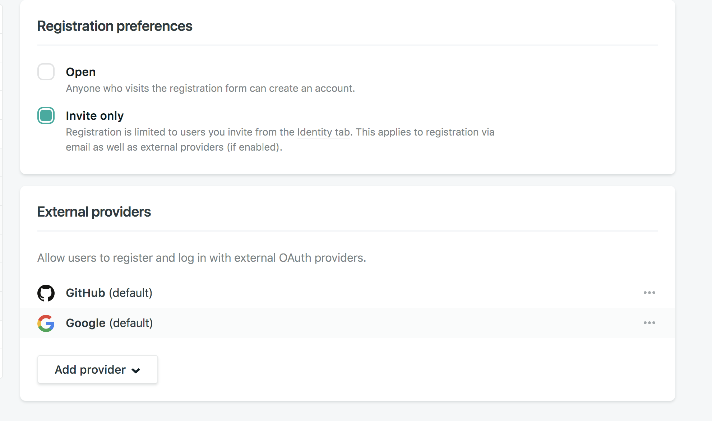
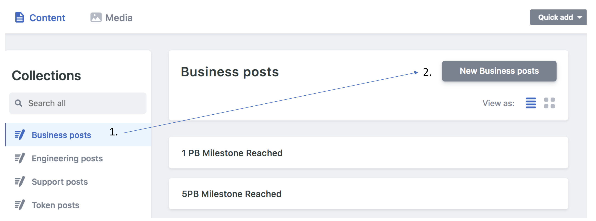
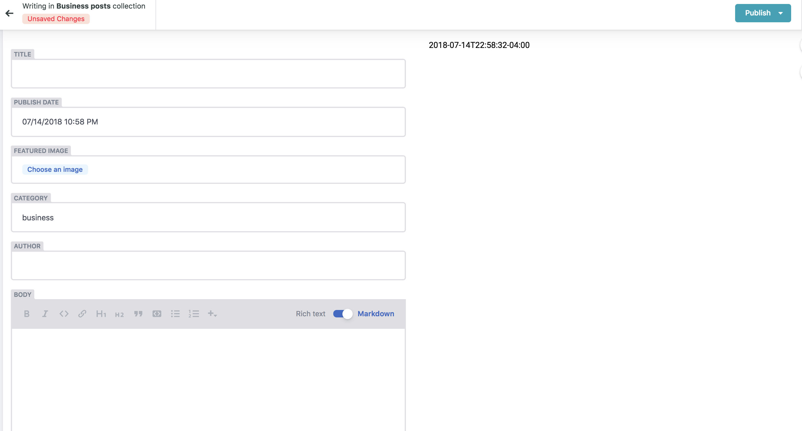
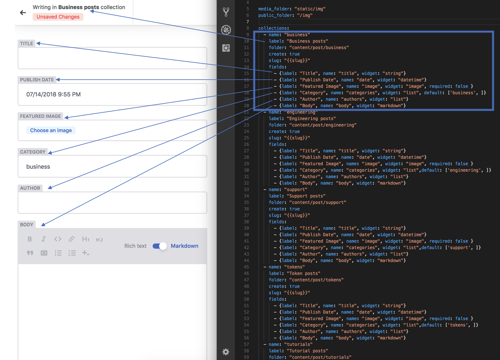
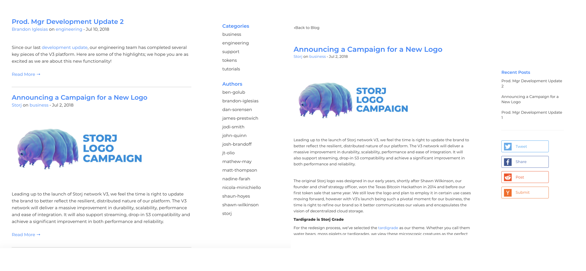
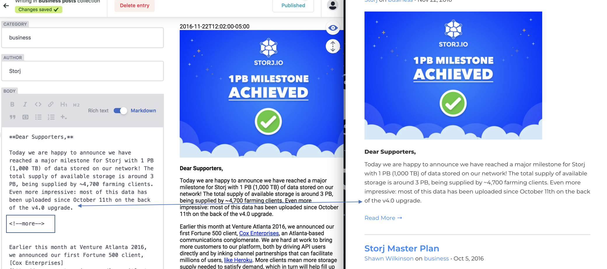
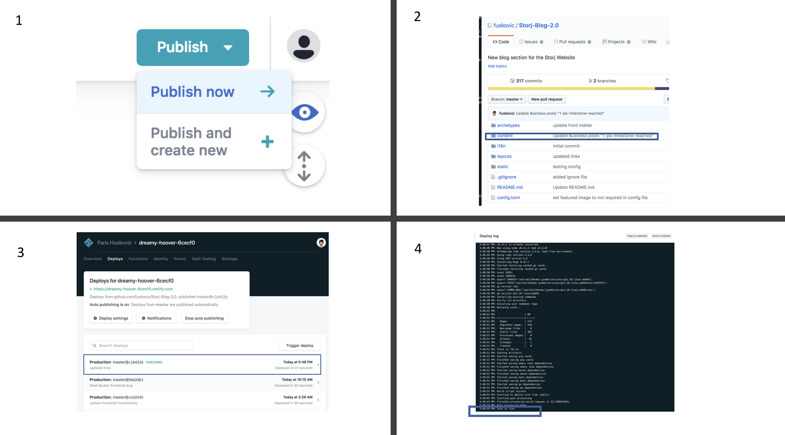

# How to post new articles using Storj Blog 2.0

by Faris Huskovic

**Purpose: To explain how the Netlify CMS is configured and how fellow team members can add posts.**

[Now Live](https://storj.io/blog).

## Pre-requisites
---

**Quick note before starting**

Below is a screenshot of our authorization configuration

Notice that we are set up to login using either our Google or Github credentials.

Also notice you may only access the CMS if you are invited to it via email. 
Please email faris@storj.io to request access.

## Step 1-Navigate to CMS and login

---

Start by appending "admin" to the end of the blog url.

## Step 2-Select Collection + initiate new post
---
Below is the Netlify CMS UI you will see upon login. 

You can see the different post types under collections on the left-hand side of the screen.  

To add a new post to the blog

- 1. Select a collection (type of post you want to create) on the left.

- 2. Click new posts.

## Step 3- Creating a Post

---

Below is a screen shot of what you will be presented with. The left-hand side contains some input fields and the right-hand side a preview pane.

The preview that's generated does not include CSS.

### How this is configured

---

Fields are mapped in a config file(right).

In our config file(right) you can see that "category" and "publish date" have default values and how the "featured image" is not required for the "Business posts" collection.

## Step 4 - Add images to your post

---

First lets understand that all our media is kept in the static/img folder per the config file.

You can select an already existing image from the folder or you can go ahead and upload one to the folder at that time if you haven't done so yet.

**Note:**
Look at the screenshots below. On the left, you see the list page (where the user will scroll through all the different articles). The image you upload will show in the summary as you see on the left. When that article is clicked, it will also show as part of the header for that article as well (right).

**Note:**
Additional images can be applied anywhere in the content body you decide using standard md syntax.

## Step 5- Draft post body + select summary

---

So the summary portion is the small excerpt that the user can see before actually clicking on the post. A special comment is used for this. When designating your summary, simply add

    <!--more-->

to the end of of where you want your summary to end, and everything that came before that comment will then be presented in the summary.

**Example:**

Look at the example above and notice where the comment was inserted when the post was being created( all the way left ) and the rendered result( all the way to the right )

## Step 6 - Publish/Deploy
---

Click on "Publish now" in the upper right hand corner and your new post has been created. Lets just take a closer look at what actually happened using the picture below.

- 1- Publish is pressed and initiates a git push origin master

- 2- New md file is placed in content(under the appropriate collection type) in the Github repo.

- 3- Netlify detects the change and deploys the update to the live site.

- 4- The deploy log can be used to determine exactly where in the deployment the update is as well as a very useful resource for debugging.

## To-do list

---

~~- Configure baseURL and Domain~~

~~- Push to prod~~

~~- Update links that point to the old blog~~

~~- Final UI updates~~
